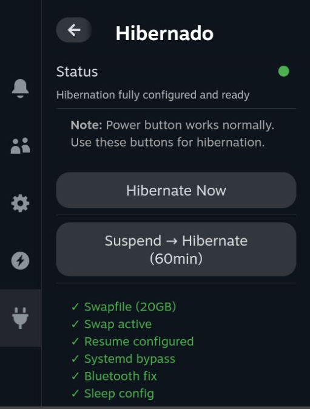

# Hibernado

A Decky Loader plugin that enables hibernation on Steam Deck. 



###  Options
- Direct hibernation - system saves state to disk and powers off completely
- Suspend then Hibernate - Suspend to RAM first, then automatically hibernate after 60 minutes (quick resume if within delay, zero battery drain after)


- Works entirely within the `/home` partition
- All changes are isolated and easily reversible
- Removes all configuration when plugin is uninstalled

## Usage

1. Open Hibernado from the Decky menu
2. Check the status indicator - if not green, click "Setup Hibernation" to configure automatically
3. Choose your power option:
   - **Hibernate Now**: Immediate hibernation (best for long-term storage)
   - **Suspend then Hibernate**: Quick suspend with automatic hibernation after delay (best for flexibility)
4. Resume by pressing the power button

## How It Works

1. **Swapfile Creation**: Creates a swapfile on `/home` (writable partition) sized to RAM + 1GB for optimal hibernation
2. **Resume Configuration**: Calculates swapfile offset and UUID, adds resume parameters to GRUB
3. **Systemd Setup**: Configures logind to allow hibernation and sets up suspend-then-hibernate timings
4. **Hardware Fixes**: Installs post-resume scripts to fix Bluetooth connectivity and SteamOS boot counting
5. **Persistence**: All changes survive SteamOS updates without filesystem unlocking

For technical details, see the implementation in `bin/hibernate-helper.sh`.

## Development

### Setup & Build

```bash
# Install dependencies
pnpm install

# Build plugin
just build
# OR
pnpm run build

# Clean build artifacts
just clean
```

### Testing on Steam Deck

Update the Deck's IP address in `justfile` (default: 192.168.0.6), then:

```bash
# Build, deploy, and watch logs
just test

# Watch logs only
just watch

# SSH to Deck
just ssh
```

The `just test` command builds the plugin, copies it to your Deck, and displays live journal logs for debugging.

## Troubleshooting

- **Setup Stuck**: Check available space on `/home` - you need at least RAM + 1GB free
- **Resume Issues**: Verify GRUB configuration at `/etc/default/grub.d/hibernado.cfg`
- **Bluetooth Problems**: The Bluetooth fix service should activate automatically; check with `systemctl status fix-bluetooth-resume.service`
- **Status Not Green**: Run setup again - the plugin verifies all components are correctly configured

## Credits

Based on the excellent guide: [Steam Deck Hibernation Guide](https://github.com/nazar256/publications/blob/main/guides/steam-deck-hibernation.md) by nazar256.

## License

BSD-3-Clause
